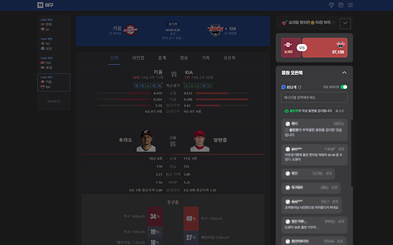

# 네이버 응원톡  

사용 페이지: m.sports.naver.com/game/*  

1. 네이버 응원톡에서 차단하고 싶은 사용자의 닉네임을 클릭하여 내용을 숨기세요. (브라우저의 로컬스토리지에 저장됩니다.) 
2. 이모티콘으로 도배하는 사용자를 신고할 수 있습니다. 
3. 닉네임을 수시로 바꿔가며 활동하는 사용자를 구분하기 위해 닉네임 옆에 고유번호가 표시됩니다. 
4. 응원팀의 엠블럼을 눌러 자동으로 응원하세요. (1인당 최대 응원 가능 수까지) 

# 아이콘  

# 캡쳐화면  

# 사용자 스크립트 설치  
[`Tampermonkey`/`Violentmonkey` 확장 프로그램을 위한 스크립트 설치](script.user.js?raw=true)
